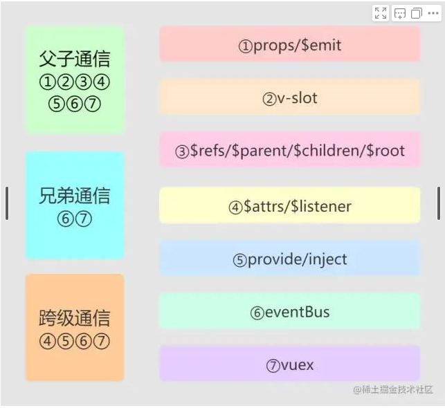

### [vue1使用方法子传父方法官网](https://v1-cn.vuejs.org/api/#vm-dispatch)
### [$dispatch和$broadcast使用官网](https://v1-cn.vuejs.org/guide/components.html#父子组件通信)  
>$dispatch和$broadcast方法，$dispatch向上级派发，直到父级的events选项内接受  
>废弃原因：基于组件树结构的事件流方式让人难以理解，并且组件结构扩展的过程中越来越脆弱，不能解决兄弟组件通信的问题


### [vue2中央事件总线实现方案](https://cn.vuejs.org/v2/guide/migration.html#dispatch-和-broadcast-替换)
### [vue2中央事件总线实现方案](https://v3.cn.vuejs.org/guide/migration/events-api.html#%E6%A6%82%E8%A7%88)
**在 Vue 3 中，借助这些 API 从一个组件内部监听其自身触发的事件已经不再可能了**
>巧妙轻量的实现了任何组件之间的通信，包括父子，兄弟，跨级
```js
<template>
    <div>
        <Input @add="addHandler"/>
        <List :list="list" @delete="deleteHandler"/>
    </div>
</template>

<script>
import Input from './Input'
import List from './List'

export default {
    components: {
        Input,
        List
    },
    data() {
        return {
            list: [
                {
                    id: 'id-1',
                    title: '标题1'
                },
                {
                    id: 'id-2',
                    title: '标题2'
                }
            ]
        }
    },
    methods: {
        addHandler(title) {
            this.list.push({
                id: `id-${Date.now()}`,
                title
            })
        },
        deleteHandler(id) {
            this.list = this.list.filter(item => item.id !== id)
        }
    },
    created() {
        // eslint-disable-next-line
        console.log('index created')
    },
    mounted() {
        // eslint-disable-next-line
        console.log('index mounted')
    },
    beforeUpdate() {
        // eslint-disable-next-line
        console.log('index before update')
    },
    updated() {
        // eslint-disable-next-line
        console.log('index updated')
    },
}
</script>
 
```
```js
// 公共组件event.vue
import Vue from 'vue'
export default new Vue()

```
```js
//子组件Input.vue
<template>
    <div>
        <input type="text" v-model="title"/>
        <button @click="addTitle">add</button>
    </div>
</template>

<script>
import event from './event'

export default {
    data() {
        return {
            title: ''
        }
    },
    methods: {
        addTitle() {
            // 调用父组件的事件
            this.$emit('add', this.title)

            // 调用自定义事件
            event.$emit('onAddTitle', this.title)

            this.title = ''
        }
    }
}
</script>
 
```
```js
//子组件List
<template>
    <div>
        <ul>
            <li v-for="item in list" :key="item.id">
                {{item.title}}

                <button @click="deleteItem(item.id)">删除</button>
            </li>
        </ul>
    </div>
</template>

<script>
import event from './event'

export default {
    // props: ['list']
    props: {
        // prop 类型和默认值
        list: {
            type: Array,
            default() {
                return []
            }
        }
    },
    data() {
        return {

        }
    },
    methods: {
        deleteItem(id) {
            this.$emit('delete', id)
        },
        addTitleHandler(title) {
            // eslint-disable-next-line
            console.log('on add title', title)
        }
    },
    created() {
        // eslint-disable-next-line
        console.log('list created')
    },
    mounted() {
        // eslint-disable-next-line
        console.log('list mounted')

        // 绑定自定义事件
        event.$on('onAddTitle', this.addTitleHandler)
    },
    beforeUpdate() {
        // eslint-disable-next-line
        console.log('list before update')
    },
    updated() {
        // eslint-disable-next-line
        console.log('list updated')
    },
    beforeDestroy() {
        // 及时销毁，否则可能造成内存泄露
        event.$off('onAddTitle', this.addTitleHandler)
    }
}
</script>
 ```

 ### 2.[$parent/$children](https://cn.vuejs.org/v2/guide/components-edge-cases.html#访问父级组件实例)
>$parent可以用来从一个子组件访问父组件的实例，提供了一种随时访问父级组件的机会，可以替代将数据以props的方式传入子组件的方式  
>$children可以遍历当前组件的全部子组件，$children并不保证顺序，也不是响应式的。vue3中移除了实例的$children属性，推荐使用$refs来访问子组件的实例  
```js
<!-- 父组件 -->
<template>
  <child-comp></child-comp>
</template>
<script>
  import childComp from './child'
  export default {
    name: 'parentComp',
    data(){
      return {
        parentMsg: 'father component'
      }
    },
    components: {
      childComp
    },
    mounted(){
      //取子组件的属性值
      console.log(this.$children[0].childMsg)
    }
  }
</script>

<!-- 子组件 -->
<template>
	<span>{{magTxt}}</span>
</template>
<script>
  export default {
    name: 'childComp',
    data(){
      return {
        msgTxt: ''
        childMsg: 'child component'
      }
    },
    created(){
      //取父组件的data属性值
      this.msgTxt = this.$parent.parentMsg
    }
  }
</script>
 
```
### 3.$root/$refs 
>$root：每个new Vue实例的子组件中都有$root属性，可以通过$root属性访问根实例，若当前组件没有父组件实例，则$root为自己  
>$refs：可以通过ref为子组件赋予一个id引用，从而实现在js里直接访问一个子组件。$refs返回一个对象，包括注册过ref的所有dom元素和组件实例，用于父组件访问子组件。  
```js
new Vue({
	data:{
		foo: 1
	},
  computed: {
		bar: function(){/* */}
  },
  methods: {
		baz: function(){/* */}
  }
})

//$root使用实例
console.log(this.$root.foo)
console.log(this.$root.bar)
console.log(this.$root.baz())
this.$root.foo = 2

//$refs使用: 父组件
<template>
  <div>
  	<my-component ref="childrenCompA"></my-component>
		<my-component ref="childrenCompB"></my-component>
  </div>
</template>
<script>
    export defalut {
      methods: {
        getMsg(){
          return this.$refs.childrenCompA.msg + this.$refs.childrenCompB.msg
        }
      }
    }
</script>
 
 ```

 ### 4.provide/inject
>隔代通讯：祖先组件通过provide来提供变量，然后在子孙组件中通过inject来注入变量。provide/inject主要解决了跨级组件间的通信问题，不过
主要使用场景为子组件获取上级组件的状态，跨级组件间建立了一种主动提供与依赖注入的关系。  
>provide选项是一个对象或者返回一个对象的函数，该对象包含可注入其子孙的属性。 
> inject选项是一个字符串数组或一个对象  
> provide和inject绑定不是可响应式的，但传入的可监听对象的property仍然可响应  

```js
<!-- 父组件 -->
 <template>
  <div class="border">
    <h1>A 结点</h1>
    <button @click="() => changeColor()">改变color</button>
    <ChildrenC />
    <ChildrenD />
  </div>
</template>
<script>
import ChildrenC from "./ChildrenC";
export default {
  components: {
    ChildrenC,
  },
  provide() {
    return {
      theme: {
        color: this.color
      }
    };
  },
  //  provide() {
  //   this.theme = Vue.observable({
  //     color: "blue"
  //   });
  //   return {
  //     theme: this.theme
  //   };
  // },
  // provide() {
  //   return {
  //     theme: this
  //   };
  // },
  data() {
    return {
      color: "blue"
    };
  },
  methods: {
    changeColor(color) {
      if (color) {
        this.color = color;
      } else {
        this.color = this.color === "blue" ? "red" : "blue";
      }
    }
  }
};
</script>
 ```
```js
//ChildrenC
<template>
  <div class="border1">
    <h2>C 结点</h2>
    <ChildrenE />
    <ChildrenF />
  </div>
</template>
<script>
import ChildrenE from "./ChildrenE";
import ChildrenF from "./ChildrenF";
export default {
  components: {
    ChildrenE,
    ChildrenF
  },
  // provide() {
  //   return {
  //     theme: {
  //       color: "pink"
  //     }
  //   };
  // }
};
</script>
```
```js
// ChildrenE
<template>
  <div class="border2">
    <h3 :style="{ color: theme.color }">E 结点</h3>
    <button @click="handleClick">改变color为green</button>
  </div>
</template>
<script>
export default {
  components: {},
  inject: {
    theme: {
      default: () => ({})
    }
  },
  methods: {
    handleClick() {
      if (this.theme.changeColor) {
        this.theme.changeColor("green");
      }
    }
  }
};
</script>
```
```js
// ChildrenF
<template>
  <div class="border2">
    <h3 :style="{ color: theme1.color }">F 结点</h3>
  </div>
</template>
<script>
export default {
  components: {},
  inject: {
    theme1: {
      from: "theme",
      default: () => ({})
    }
  }
};
</script>

```

 ### 5.$attrs/$listeners
隔代通讯
>$attrs：存放的是父组件中绑定的非Props属性  
包含了父作用域中不被prop所识别（且获取）的特性绑定（class和style除外）  
当一个组件没有声明任何prop时，这里会包含所有父作用域的绑定（class和style除外）  
可以通过v-bind=“$attrs”传入子组件，通常配合inheritAttrs选项一起使用 
$listeners：存放的是父组件中绑定的非原生事件，vue3移除  
包含了父作用域中的（不含.native修饰器的）v-on事件监听器  
可以通过v-on=“$listeners”传入子组件  
```js
<!-- 父组件 -->
<template>
  <div>
  	<child-a :name="name" :age="age" :job="job" 
             title="this is a title" @click="console.log("hello")"></child-a>
  </div>
</template>
<script>
  import ChildA from './ChildA'
  export default {
    components:{
      ChildA
    },
    data(){
      return {
        name: 'tao',
        age: "28",
        job: "worker"
      }
    }
  }
</script>

<!-- 子组件 -->
<template>
	<div>
    <child-b v-bind="$attrs" v-on="$listeners"></child-b>
  </div>
</template>
<script>
  import ChildB from "./ChildB"
  export default{
    name: "child-a",
    components: {
      ChildB
    },
    created(){
      console.log(this.$attrs) //{name: "tao", age: "28", job: "worker", title: "this is title"}
      this.$listeners.click() //Hello
    }
  }
</script>

<!-- 孙组件 -->
<template>
	<div>
    <p>B-listeners: {{this.$listeners.click()}}</p>
  </div>
</template>
<script>
  export default {
    props: ["name"], //name作为props属性绑定
    created(){
      console.log(this.$attrs) //{age: "28", job: "worker", title: "this is title"}
      this.$listeners.click()  //hello
    }
  }
</script>
 
```
